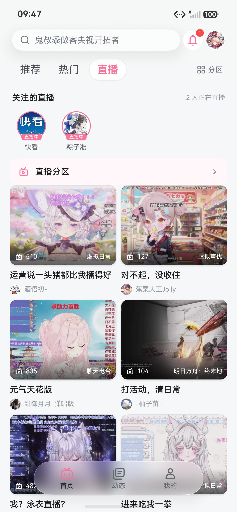
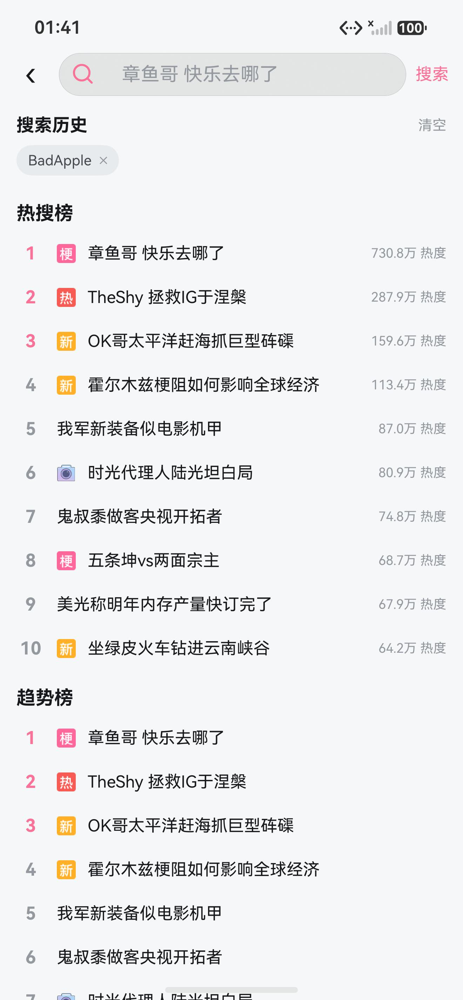

<div align="center">

# BiliHarmony

**HarmonyOS NEXT 原生第三方哔哩哔哩客户端**

以 [PiliPlus](https://github.com/bggRGjQaUbCoE/PiliPlus) 的功能与协议实现为参考，使用 ArkTS / ArkUI 构建鸿蒙原生界面，接入 libmpv 视频内核、Canvas 弹幕、画中画和后台音频能力。

`HarmonyOS API 26` · `ArkTS + ArkUI + C++` · `libmpv / OHCodec`

**[下载最新版本](https://github.com/F1yingWhite/biliharmony/releases/latest)** · [历史版本与安装包](https://github.com/F1yingWhite/biliharmony/releases) · [更新日志](CHANGELOG.md) · [测试说明](tool/qa/README.md)





<p><sub>截图来自 1.3.2 · HarmonyOS 模拟器 · 2026-10-02</sub></p>

</div>

> 本项目仅供学习交流，是第三方客户端，与哔哩哔哩官方无关联。哔哩哔哩及相关商标归其权利人所有。

## 主要功能

| 场景 | 能力 |
| --- | --- |
| 浏览与搜索 | 首页推荐、热门、直播；排行榜、分区、番剧索引与新番时间表；热搜、联想、本地搜索历史及多类搜索结果 |
| 视频与番剧 | DASH 音视频分流播放、清晰度与倍速切换、分 P / 合集 / 番剧选集、续播、自动连播、字幕、手势控制、全屏、画中画与后台音频 |
| 弹幕与进度 | Canvas 弹幕，透明度、速度、字号、密度与屏蔽规则；章节分段、拖动预览、高能热度条、小电视空降助手 |
| 直播 | 直播分区与房间播放、画质切换、WebSocket 弹幕、表情及醒目留言（SC） |
| 互动 | 点赞、投币、收藏、关注、分享；评论与楼中楼、表情、举报、评论图片分享；文字 / 图文动态 |
| 个人数据 | 观看历史、稍后再看、收藏夹管理、追番与观看状态、关注分组、黑名单 |
| 私信与通知 | 会话、聊天、置顶、举报；回复、@我、赞、系统通知与已读确认 |
| 登录 | TV 扫码、Web 扫码、密码与短信登录；登录态持久化、Cookie 续期和导入 / 导出 |
| 下载与导出 | 视频 / 音频缓存队列、进度与失败重试；媒体、弹幕 XML、字幕 SRT、封面导出 |
| 鸿蒙适配 | 开播系统提醒、沉浸式系统栏、深色与定时深色、封面取色主题、可选玻璃材质、实验性宽屏分栏 |

小电视空降助手可按片段类别设置自动跳过、静音、标记或手动操作。章节条的白色背景按播放位置填充：已播放章节填满，当前章节只填充已播放部分，尚未播放的章节保留底色；横滑预览时同步显示预览位置。

播放画面横滑可按秒快进或后退：一屏宽度最多移动 60 秒，短视频按自身时长缩小范围，预览显示实际移动秒数与目标时间，松手后定位。大跨度跳转可拖动进度条。

视频举报可从播放器更多菜单或视频卡片菜单进入。普通举报需选择类型并填写详细描述；涉及权益申诉或额外材料的类型进入官方表单完成。

YouTube 浏览为实验功能，提供搜索、相关推荐、本地历史与稍后看，详情页使用 ArkWeb IFrame 播放。实际可用性受网络与平台验证影响。

## 安装到手机或模拟器

工程的编译、兼容和目标 SDK 均为 **HarmonyOS API 26**，目标设备为手机和平板。请使用兼容此 SDK 的 HarmonyOS NEXT 设备或模拟器。

1. 从 [最新版本](https://github.com/F1yingWhite/biliharmony/releases/latest) 获取 HAP，并查看该版更新日志与签名说明。[历史版本](https://github.com/F1yingWhite/biliharmony/releases) 保留各版安装包和校验和。
2. 当前仓库的 GitHub Actions 发布 **未签名 release HAP**。真机安装需使用针对目标设备配置签名的 HAP，可在 DevEco Studio 中配置自动签名后构建、运行。
3. 使用 `hdc list targets` 确认设备 ID，再安装对应的已签名产物。多设备连接时用 `-t` 指定目标。

```powershell
# 示例：DevEco Studio 安装在此路径时；自定义安装请替换路径。
$devEco = 'C:\Program Files\Huawei\DevEco Studio'
$hdc = "$devEco\sdk\default\openharmony\toolchains\hdc.exe"
& $hdc list targets
& $hdc -t '<设备 ID>' install -r 'entry\build\default\outputs\default\entry-default-signed.hap'
& $hdc -t '<设备 ID>' shell aa start -a EntryAbility -b com.piliplus.harmony
```

覆盖安装要求包名与签名兼容。构建失败后不要使用输出目录中残留的旧 HAP 判断本次版本是否安装成功。

## 从源码构建

### DevEco Studio

安装 DevEco Studio 和 HarmonyOS API 26 SDK，打开仓库根目录，完成工程同步与依赖安装。连接设备，在工程签名设置中配置自动签名，然后执行 Run。

应用模块位于 `entry/`，应用包名为 `com.piliplus.harmony`。视频内核通过本地 NAPI 模块动态链接固定的 ARM64 libmpv；构建需 DevEco / hvigor 与 SDK 内的 C++ 工具链。来源、许可证和包检查见 [播放内核说明](docs/player-core-reuse.md)。

### Windows 命令行

以下命令在仓库根目录运行。签名需先在本机配置完成；SDK 或 DevEco 安装位置不同，请相应修改路径。

```powershell
$devEco = 'C:\Program Files\Huawei\DevEco Studio'
$env:NODE_HOME = "$devEco\tools\node"
$env:JAVA_HOME = "$devEco\jbr"
$env:DEVECO_SDK_HOME = "$devEco\sdk"
$env:PATH = "$env:NODE_HOME;$env:JAVA_HOME\bin;$env:PATH"

& "$devEco\tools\ohpm\bin\ohpm.bat" install --all
& "$devEco\tools\hvigor\bin\hvigorw.bat" assembleHap --mode module -p product=default -p buildMode=debug --no-daemon
```

将 `buildMode=debug` 改为 `buildMode=release` 可构建发布模式；在 `assembleHap` 前加 `clean` 可执行清理构建。产物目录为 `entry/build/default/outputs/default/`，是否生成 signed HAP 取决于本机签名配置。

### macOS 命令行

`tool/build.sh` 默认使用 `/Applications/DevEco-Studio.app` 下的 Node、JDK 和 SDK。自定义安装位置需调整脚本中的工具链路径。

```bash
bash tool/build.sh
bash tool/build.sh clean release
```

脚本会安装 OHPM 依赖，并将 hvigor / npm 缓存放入工程 `.home/`。首次构建需要网络。

### GitHub Actions 发布

[release-hap.yml](.github/workflows/release-hap.yml) 在推送到 `main` 或手动触发时执行回归、构建 release HAP、检查实际包内容并生成 SHA-256 文件。每次成功构建都有 Actions artifact；首次发布某个应用版本时创建对应的 `v<versionName>` 标签与正式 Release，例如 `v1.4.0`，安装包名也包含版本号。

版本号以 [AppScope/app.json5](AppScope/app.json5) 为准。准备新版本时同时递增 `versionName`、`versionCode`，并在 [CHANGELOG.md](CHANGELOG.md) 记录变化。Release 包含该版日志、提交范围和构建提交。已发布的标签、安装包和说明不会被后续推送覆盖；同版本的后续开发提交只生成 Actions artifact，发布前需升版本号。

在应用「我的」中可以查看已安装版本、打开「历史版本」与「更新日志」。GitHub 的 [最新版本链接](https://github.com/F1yingWhite/biliharmony/releases/latest) 指向最新编号发布；原来的 `latest` 标签只保留旧链接兼容，现存旧包归档为 `v1.3.2`。此前被滚动发布覆盖的更早安装包无法恢复，早期功能记录仍保留在 CHANGELOG。

本机签名证书、Profile 和密码应保留在本机，不能随源码提交。

## 测试与验证

### 无需设备的回归

使用 DevEco 自带 Node 和 TypeScript，或指定已有的 TypeScript 模块路径。Windows 示例：

```powershell
$devEco = 'C:\Program Files\Huawei\DevEco Studio'
$env:ARKTS_TEST_TYPESCRIPT = "$devEco\tools\hvigor\hvigor\node_modules\typescript"
& "$devEco\tools\node\node.exe" --test --test-timeout=20000 tool/qa/*.test.cjs
```

工具链已加入 PATH 时也可以运行：

```bash
node --test --test-timeout=20000 tool/qa/*.test.cjs
```

回归通过转译并执行生产 ArkTS 模块或方法，使用可控平台替身覆盖请求乱序、账号隔离、消息游标、缓存、播放恢复、收藏提交和资源释放等边界。`ARKTS_TEST_TYPESCRIPT` 用于指定转译器位置。

### 设备 UI 与播放器验收

需要 Python 3、hdc、配置完成的构建工具链以及可用设备。用 `QA_HDC` 指定 hdc 路径，`QA_TARGET` 指定设备 ID：

```powershell
$env:QA_HDC = 'C:\Program Files\Huawei\DevEco Studio\sdk\default\openharmony\toolchains\hdc.exe'
$env:QA_TARGET = '<设备 ID>'
python tool/qa/run_all.py

# 已安装本次版本时，只执行播放器专项。
python tool/qa/suite_player.py --skip-install
```

完整流程包含构建、安装、页面回归、深度链路、播放器专项和 UI 审计，默认产物写入 `.emulator/qa/`。播放器专项依赖网络、账号权限和测试视频可用性。

Node 回归不能替代完整 `CompileArkTS`、真机播放和 UI 验收。用例数量与通过结果以实际运行记录为准；具体覆盖与工具使用见 [QA 说明](tool/qa/README.md)，本轮重构范围与验证记录见 [2026-10-02 重构验收](docs/refactor-plan-2026-10-02.md)。

## 代码组织

```text
entry/src/main/ets/
├── entryability/           # 应用入口、主题与系统窗口初始化
├── pages/                  # 路由页面、响应式状态发布、布局与导航
├── views/                  # 首页、动态、我的等主视图
├── components/
│   ├── player/             # 单内核播放会话、生命周期、弹幕与播放器视图
│   ├── video/              # 视频详情初始化、互动、选集播放与推荐
│   ├── bangumi/            # 番剧选集目录、选集布局与追番控制器
│   ├── live/               # 直播连接会话、有界弹幕缓存与播放器
│   ├── dynamic/            # 分类信息流、卡片互动、发布草稿与图片资源
│   ├── search/             # 查询结果、分页、联想与筛选展示
│   ├── home/               # 首页三频道、曝光窗口与本地过滤
│   ├── user/               # 用户投稿排序、分页与关注分组事务
│   ├── favorites/          # 收藏夹、夹内视频、收藏集分页与编辑事务
│   ├── message/            # 会话列表、私信发送与精确已读游标
│   ├── youtube/            # 公开搜索、评论、缩略图缓存与 Web 播放生命周期
│   └── reply/              # 评论、楼中楼、提交事务与图片分享
├── api/                    # 按业务领域组织的接口请求与结果适配
├── model/                  # 领域模型；Models.ets 提供兼容导出入口
├── services/
│   ├── network/            # HTTP、响应解析、凭证策略与代理
│   ├── auth/               # 登录态、账号会话与 Cookie 续期
│   ├── media/              # 播放源协调、下载与相册保存
│   └── …                   # 消息、缓存、提醒及用户数据服务
├── common/                 # 路由、签名、主题、精确消息游标与公共工具
└── workers/                # 直播弹幕解码任务

tool/qa/                    # Node 回归、跨平台构建和设备验收工具
docs/                       # 设计、接口、审查和验证记录
```

页面负责 ArkUI 布局、导航、滚动与系统交互；领域控制器持有稳定数据源、分页游标、请求代际和编辑事务，通过类型明确的状态快照更新页面。动态卡片、发布面板和搜索卡片独立成组件，避免信息流页面同时处理所有操作。

HTTP 文本请求共用凭证检查、传输、Cookie 合并和解析流程；`HttpResponse` 管理响应与解析缓存。`common/MessageCursor.ets` 使用十进制字符串保存和比较消息序号，避免 int64 精度丢失影响分页、去重或已读确认。账号相关请求同时验证目标、请求代际与账号会话，旧账号的结果不能回写新页面。

`PlayerPlaybackSession` 管理播放意图、画质与 CDN 重试，`PlayerEngineController` 持有一个内核并隔离旧事件，`PlayerMpvEngine` 将原生状态交给业务层。libmpv 在同一会话中管理 DASH 音视频解码、缓冲、时间戳同步和精确定位；`entry/src/main/cpp/` 提供异步 NAPI 桥接。`PlayerView` 接收播放状态和事件；画中画、章节与弹幕请求、截图预览、下载导出各自管理异步资源。保存操作先固定源、画质与字幕轨，取消选择器不会提示保存成功。

全面重构的范围与验收记录见 [2026-10-02 重构计划](docs/refactor-plan-2026-10-02.md)。Node 回归与静态依赖检查约束模块边界，原生播放效果仍需完整构建和设备验证。

## 已知边界

- 清晰度、字幕、番剧观看和其他账号相关能力受接口返回与账号权限约束。
- 下载中心暂不在应用沙箱中合成 DASH 分离音视频；仅有分离流的画质不能直接缓存为单个 MP4。
- 大会员购买、充电、送礼、创作中心、直播回放和历史弹幕不在当前功能范围内。
- 宽屏分栏为外观设置中的实验开关，在窗口宽度达到 840vp 时生效；YouTube 为实验功能。
- 桌面“继续观看”卡片已取消注册，相关未使用源码已删除；应用内续播记录仍保留。
- 真机、弱网和所有账号 / 设备组合尚未穷举；构建告警和具体测试限制以对应验证记录为准。

## 文档与贡献

- [更新日志](CHANGELOG.md)：版本变化与功能记录。
- [PiliPlus 移植对照](docs/移植对照-PiliPlus.md)：上游模块与 ArkTS 实现对应关系。
- [UI 与导航设计](docs/UI与导航设计方案-v1.md)：页面和导航决策。
- [网页端功能对照](docs/Roadmap-对照网页端.md)：功能差距与后续方向。
- [ArkUI 易错清单](docs/ArkUI易错清单.md)：开发前应了解的 ArkTS / ArkUI 约束。
- [API 文档](docs/api/)：接口调研与复现材料。
- [重构与回归记录](docs/refactor-plan-2026-10-02.md)：职责拆分、正确性修复和验证证据。

提交修改前，执行与改动相关的回归和完整 HAP 构建；涉及播放器、导航或交互的修改还需在设备上验收。问题报告请附设备 / 系统版本、复现步骤、实际表现与必要日志，移除 Cookie、Token、账号和签名信息。

## 致谢

- [PiliPlus](https://github.com/bggRGjQaUbCoE/PiliPlus)：功能蓝本与协议实现参考。
- [BewlyBewly](https://github.com/BewlyBewly/BewlyBewly)（MIT）：首页卡片设计、频道胶囊与分区图标集。
- [MingCute Icon](https://github.com/Richard9394/MingCute)（Apache-2.0，经 [Iconify](https://iconify.design) 分发）：界面图标。
- [BilibiliSponsorBlock](https://github.com/hanydd/BilibiliSponsorBlock)（GPL-3.0）：空降助手协议与交互设计。

上游项目与素材的授权及归属应按各自原始声明保留；分区图标声明见 [NOTICE](entry/src/main/resources/rawfile/icons/channels/NOTICE)。
